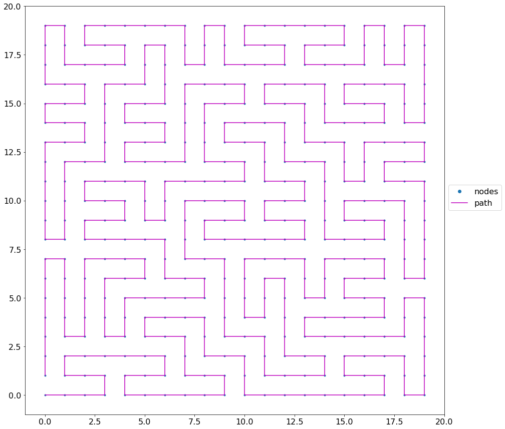
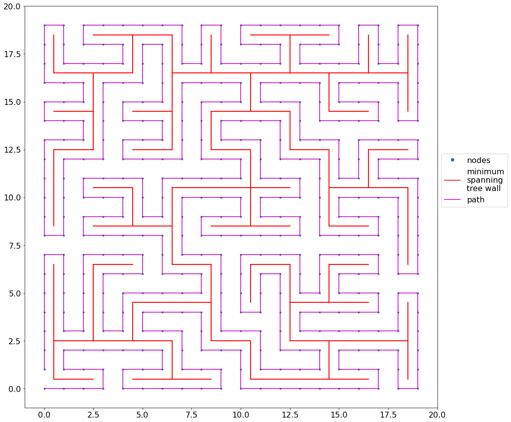
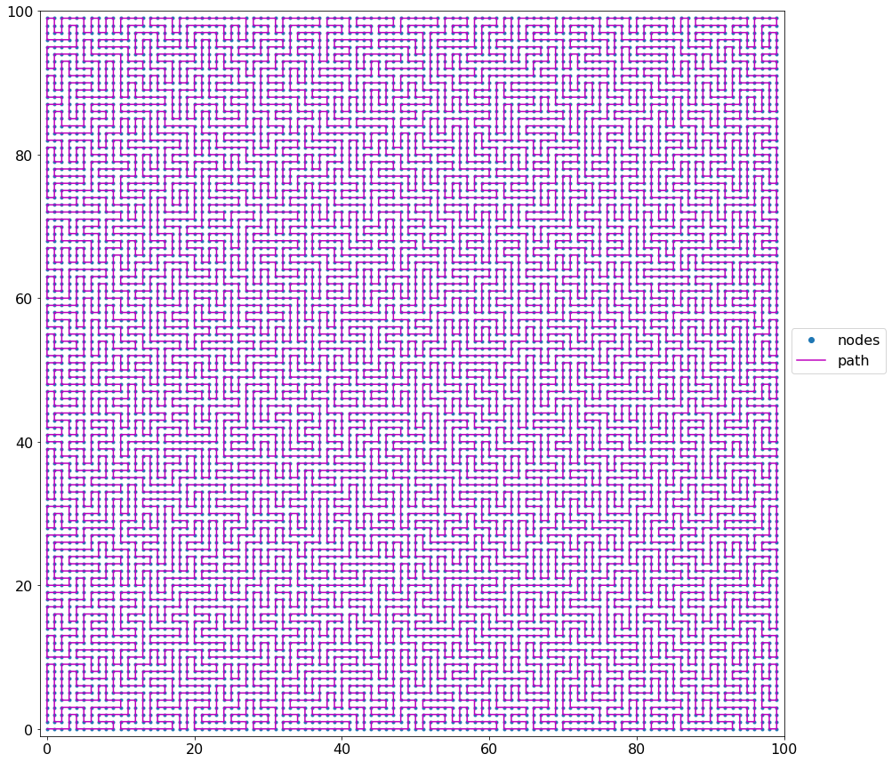
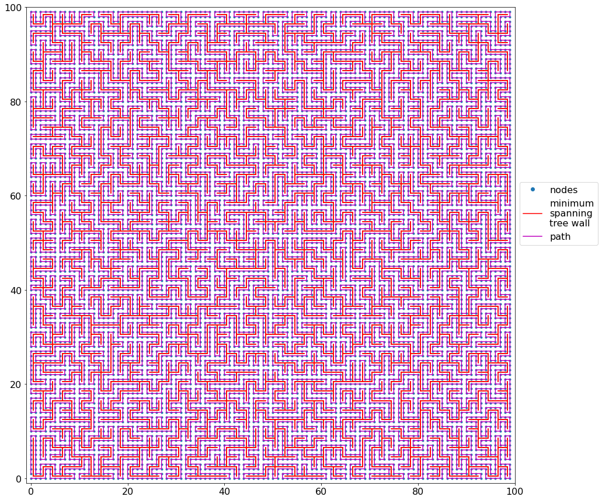
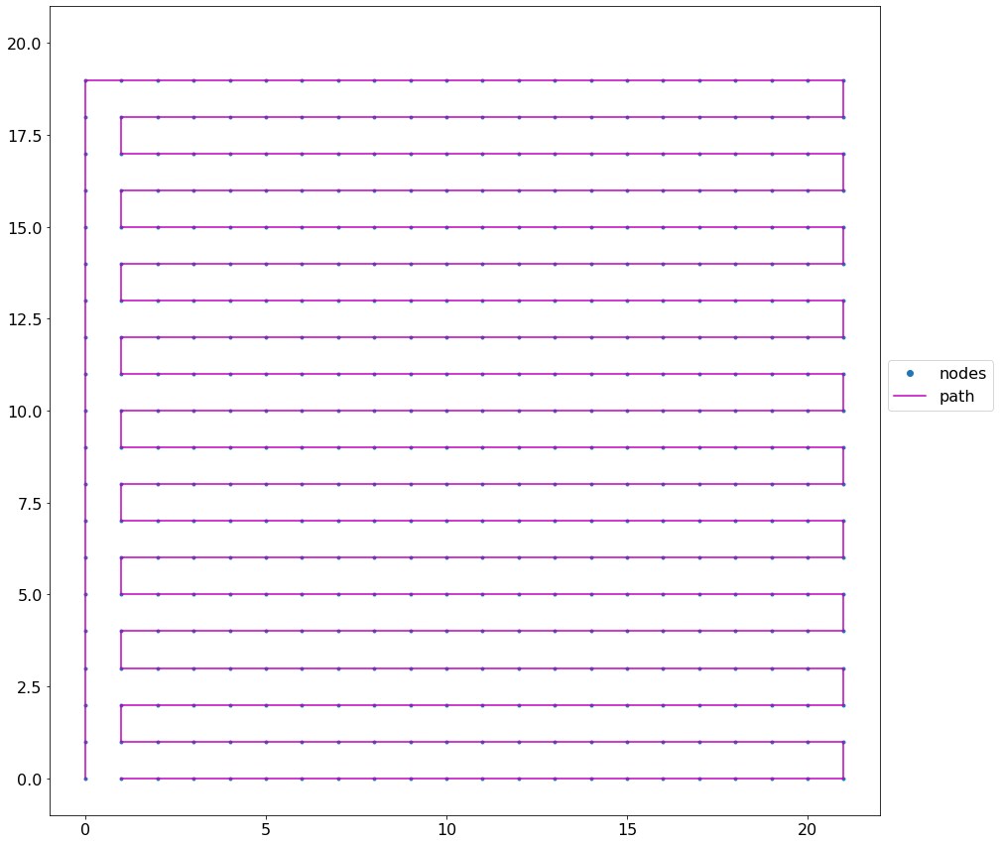
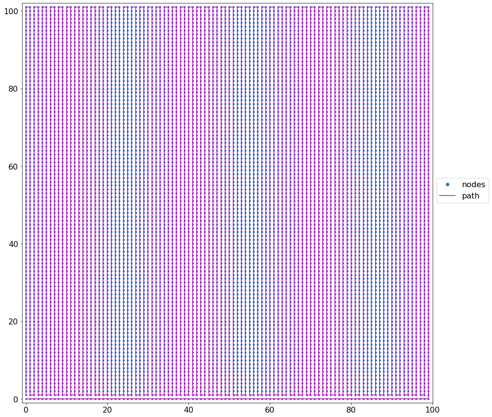

# Hamiltonian-cycle
Module with functions to create random and deterministic hamiltonian cycle.

### Scripts

**hamiltonian.py**: is the module with the functions to create random and determinit hamiltonian cycle for a regular (square or rectangular) mesh.

  - kurskal: function to construct the minimum spanning tree through kurskal algorithm.
  - make_square_mesh: function to construct the nodes mesh position.
  - tree_square_mesh: function to construct the tree of connections between nodes mesh position.
  - tree_mesh_unit: function to construct the nodes mesh tree.
  - derand_centres: function to construct the nodes mesh position.
  - tree_nodes_centers: function to construct the nodes mesh position.
  - make_path: function to construct the nodes mesh position.
  - random_hamiltonian_cycle: function to create -if it is possible- a random hamiltonian cycle path.
  - deterministic_cycle: function to create a hamiltionian cycle through a determinisc method.

**exemple.py**: is the script that contain some example about the use of functions from hamiltonian.py

  - if 'random_cycle' is in the list to_do: create and plot a random hamiltonian cycle with the given parameters.
  - if 'deterministic_cycle' is in the list to_do: create and plot a deterministic hamiltonian cycle with the given parameters.

### Examples

Here are some examples of what we can have for random and deterministic method.

A 20 by 20 random cycle without the plot of the walls.

A 20 by 20 random cycle with the plot of the walls.

A 100 by 100 random cycle without the plot of the walls.

A 100 by 100 random cycle with the plot of the walls.

A 20 by 21 deterministic cycle.

A 101 by 100 deterministic cycle.

